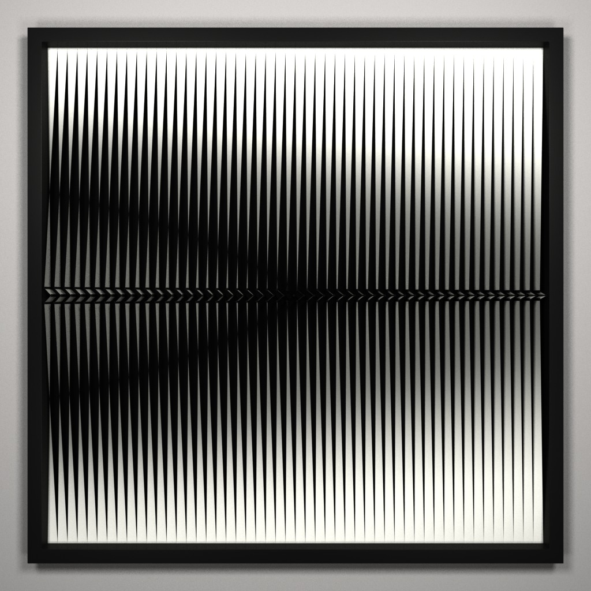

# Maya stripes

A Maya plugin to generate stripes that emulate the 
[works of Alberto Biasi](https://www.google.com/search?q=alberto+biasi&tbm=isch).
## Quick start
1. Put `/src/maya-stripes.py` into one of the possible plugin folders of Maya
2. Open Maya and load the plugin using **Windows > Settings/Preferences > Plug-in Manager**. If you don't find the plugin in the list, double check that you've put `/src/maya-stripes.py` in the right folder and then hit the **Refresh** button of the **Plug-in Manager**
3. Load the scene `/docs/examples/scenes/barebone.mb`
4. Select the `root_GRP` group from the **Outliner**
5. Launch the `doStripes` MEL command.  

Examine the hierarchy of the `root_GRP` group of `/docs/examples/scenes/barebone.mb` to be able to use the plugin in your own scenes.

## Videos
* [On my twitter](https://twitter.com/giuliom_95/status/888699985696620544)
* [On my July 2017 reel](https://vimeo.com/giuliom95/reeljul2017#t=39s)

## Images
These images have been rendered by non-commercial Pixar Renderman 21
  
  
  
